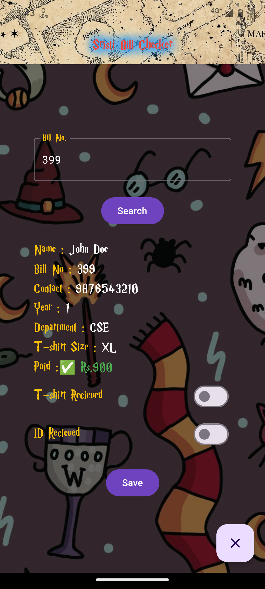
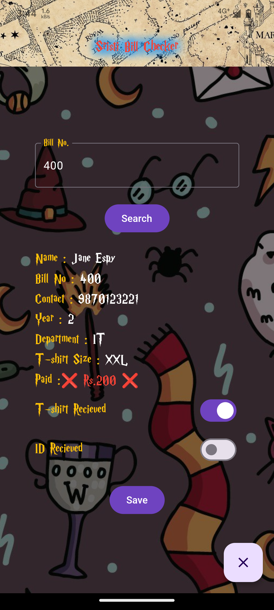

<br/>
<p align="center">
  <a href="https://abhigyan103.github.io/sristi-bill-checker/">
    
  </a>

  <h3 align="center">Bill Checker</h3>

## Live public Version
 [Click Here](https://abhigyan103.github.io/sristi-bill-checker/)

## About The Project
<div style="display:flex">
</div>

This project was inspired by the need of a bill management system for the tech-fest in my college. It was for people who wanted to check their payment status and for admins to update their status with a sooth experience.

## Built With

This project is built with 
* Flutter
* Google Sheets API dependency.

## Getting Started

This is how you may set up your project locally.
To get a local copy up and running follow these simple example steps.

### Prerequisites

You would need :
1. Android Studio/ VS Code / Any other coding IDE
3. Flutter

### Installation

1. Run the command : 
```sh
flutter create <app_name>
```
2. Copy the assets folder in your project directory
3. Replace /lib and pubspec.yaml file
4. Run the command : 
```sh
pub get
```
5. Now run the flutter app
